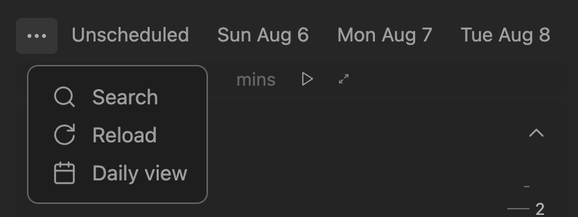

Time Ruler combines the best parts of a nested tasklist and an event-based calendar view. Drag-and-drop tasks to time-block and reschedule, and view tasks on top of read-only online calendars. Integrates well with the Tasks, FullCalendar, and Reminder plugins.

# Features
- **Reads and writes tasks** in a variety of formats (Dataview inline fields, Tasks plugin emojis, or Full Calendar task-events)
- **Time-blocks** with nested tasks
- **Search** and filter scheduled, unscheduled, and due tasks 
- **Drag 'n drop** tasks to reschedule and change length
- Show all **files and headings**, drag to create new tasks
- **Create** new tasks at specific times via drag-and-drop
- Read-only **online calendars** via sharing links
- Integrated **timer/stopwatch** for Pomodoro and time-tracking
- Play a **sound** when you check a task!

# Documentation
Time Ruler uses the [Dataview](obsidian://show-plugin?id=dataview) plugin to read tasks, so please install it before you use this plugin.

## Reading tasks
Task metadata can be specified in any of the following formats:
- **Simple**: (only in Daily Notes) `hh:mm - hh:mm task content > mm-dd ?/!/!!/!!!`
- **Dataview**: `[scheduled:: yyyy-mm-ddThh:mm]  [due:: yyyy-mm-dd]  [length:: #h#m]  [priority:: lowest/low/medium/high/highest]`
- **Tasks**: `[startTime:: hh-mm]  [length:: #h#m] ⏳ yyyy-mm-dd 📅 yyyy-mm-dd ⏬/🔽/🔼/⏫/🔺`
- **Full Calendar**: `[date:: yyyy-mm-dd]  [startTime:: hh-mm]  [endTime:: hh-mm]  (or [allDay:: true]) [due:: yyyy-mm-dd]  [priority:: lowest/low/medium/high/highest]`

### Reminder
You can specify any of the [Obsidian Reminder](https://obsidian-reminder.cf/guide/set-reminders.html#reminder-format) formats as well. 

When editing a task via drag-and-drop, tasks are converted back to the formatting detected in the task. If this is not possible, the user's preferred format (Dataview, Tasks, or Full Calendar) is used. This can be changed in Settings. 

*Note:* Double-spaces are used between brackets because without them, Obsidian thinks they are markdown links.

## Scheduling tasks

- To **reschedule** a task, drag-and-drop the task onto the target block or time. You can drag a task to one of the day buttons or a day's heading to reschedule to that day. Click on a task to jump to it in Obsidian.
- To **create** a new scheduled task, drag the heading from the Search popover onto a target time, or click the `+` button on the target time or block. A new task is created in the chosen file or heading.
- To change the **length** of a task, drag it by the bottom (the "resize arrow" cursor) to a target time.
- You can also drag **groups, headings, and blocks** to reschedule all of the tasks contained in them.
- Dragging and holding over a **date button** will scroll to that date, allowing you to drop the task there.

## Buttons

- **Search**: Show all tasks and headings. Filter by tag, priority, filepath, or heading.
- **Daily / Hourly view**: Toggle between daily and hourly views. In daily view, hours are hidden. 
- **Refresh**: Reload Obsidian tasks and online calendars.
- **Unscheduled:** Drag a task here to unschedule it. Click to show unscheduled tasks.
- **Days:** Click to scroll to that date, drag a task on top to schedule it for that date.

## Obsidian integrations
- **Click** on tasks and headings to show them in Obsidian (Time Ruler will update while you edit them)
- You can drag the Time Ruler tab icon into the **main editor** to expand it, showing an expanded four-day view. 

## Online calendars
- To **import** a calendar, simply copy a shared link (iCal format) into Settings.
- **Events** show as blocks which can contain tasks scheduled at the same time. You can drag an event to reschedule the tasks contained, but the event is read-only. 
- To **refresh** events, click the `Refresh` button (the circular arrow) in the toolbar.

## Timer

- To start a **stopwatch**, click the play button without any time entered.
- To start a **timer**, enter an amount in minutes and press the play button or "Enter."
- You can **add or subtract** 5 minutes while the timer is playing by clicking the `+` and `-` buttons. 
- Click the `focus` button (outwards arrows) to expand the timer and focus on current tasks. Shows all-day tasks if Calendar view is on, and only time-based tasks if not.

## Customization Settings
- **Custom Filter**: This is passed to `dv.pages(<custom filter>)`. It only filters out certain pages, and can't filter specific tasks within those. Use Custom Statuses to filter out tasks. 
- **Custom Status**: Either **include only** certain custom statuses, or **exclude all** specified custom statuses (characters between `[ ]` in tasks).

# Credit
- Many thanks to the [Dataview](obsidian://show-plugin?id=dataview), [Tasks](obsidian://show-plugin?id=obsidian-tasks-plugin), and [Full Calendar](obsidian://show-plugin?id=obsidian-full-calendar) plugins for setting the standards and formatting for managing tasks across the Obsidian vault.
- The Dataview plugin's MetadataCache made Time Ruler possible, so a huge thanks for the automatic indexing and parsing of task metadata.

# Network Usage
Upon calendar refresh, the plugin makes a single GET request to any calendars you are subscribed to, which downloads their events in .ics format. 

# Changelog
For more information on past and future updates, please consult the [roadmap and changelog](https://github.com/joshuatazrein/obsidian-time-ruler/blob/master/CHANGELOG.md).

If you appreciate this plugin, I would love your support for further development!

